# Nusa News

Nusa News is an offline-first news reader for Indonesian top headlines. Kotlin Multiplatform carries the complete domain and data pipeline; two native presentation layers consume it — Jetpack Compose on Android and SwiftUI on iOS.

## Feature status

| Requirement | Status | Implementation |
|---|---|---|
| KMP shared business/data code | Done | Domain, Ktor, Room schema/DAO, mapping, repository policy, use cases, and Koin definitions are in `shared/commonMain`, compiled for Android and iOS device/simulator targets. |
| Clean Architecture | Done | Android presentation depends on domain use cases; the data layer implements the domain repository contract. |
| Article list and detail | Done | Compose list/detail screens with stable type-safe Navigation Compose routes. |
| Offline-first cache | Done | Room is the only article read path; refresh writes transactionally and Room emissions update the UI. |
| Pull-to-refresh | Done | Refresh is guarded against concurrent jobs and keeps cached content visible. |
| Loading, empty, and error handling | Done | Dedicated initial, empty, blocking-error, and saved-content recovery states. |
| Ktor timeouts and safe logging | Done | Request/connect/socket timeouts; debug headers only; `X-Api-Key` is sanitized. |
| Meaningful KMP tests | Done | Success pipeline, cached fallback, dual failure, malformed payload preservation, URL/auth contract, and date formatting. |
| Compose UI tests | Done | List → detail → back and cached/offline rendering run on an Android emulator. |
| Runnable iOS app (bonus) | Done | `iosApp` is a native SwiftUI client over the same shared use cases; it builds and runs on the iOS Simulator. |
| Dark theme and accessibility polish | Done | System light/dark schemes, resource-backed strings, content descriptions, and stable semantics tags. |
| AI-assisted development record | Done | Six representative sessions documented with verbatim prompts, agent output, and the corrections applied — see [AI-assisted development](#ai-assisted-development). |

## Screenshots

Both apps run the same shared pipeline and the same design tokens; each renders it with its own
native toolkit.

### Android — Jetpack Compose

| Feed | Article detail | Offline with cached stories |
|---|---|---|
| 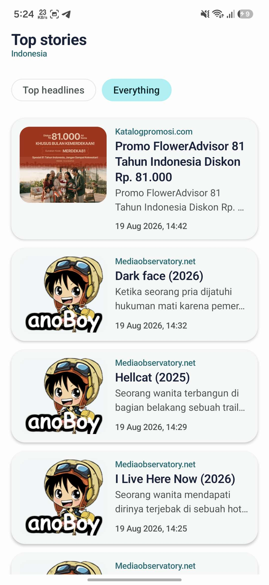 |  | 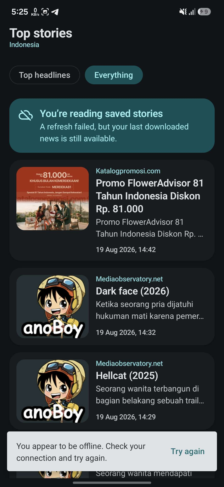 |
| 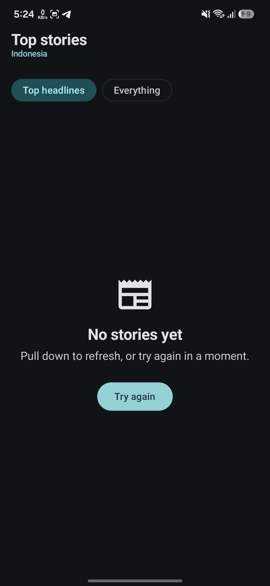 | 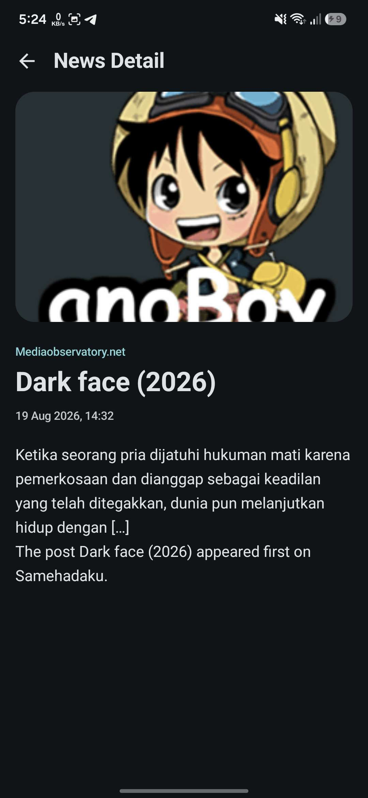 |  |

The third image is the offline-first behaviour the brief asks for, captured in one frame: the
network refresh failed, the previously cached articles are still on screen, a saved-stories notice
explains why, and a non-blocking snackbar offers a retry. Nothing is lost and nothing is blank.

### iOS — SwiftUI

| Feed | Article detail | Full-screen image viewer |
|---|---|---|
| 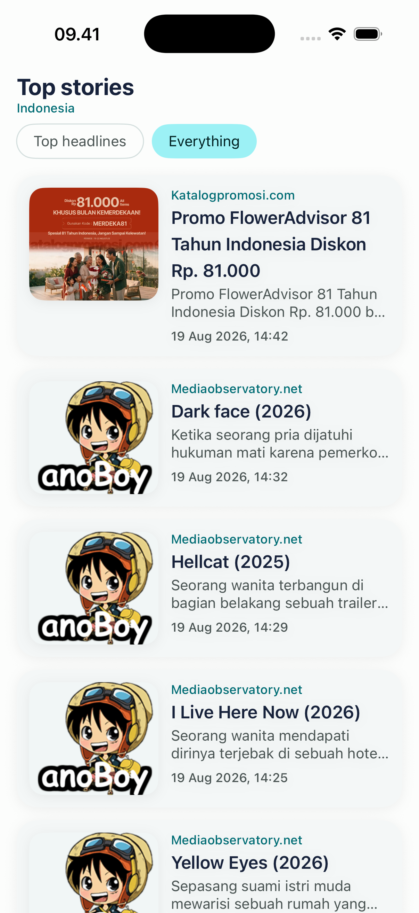 | 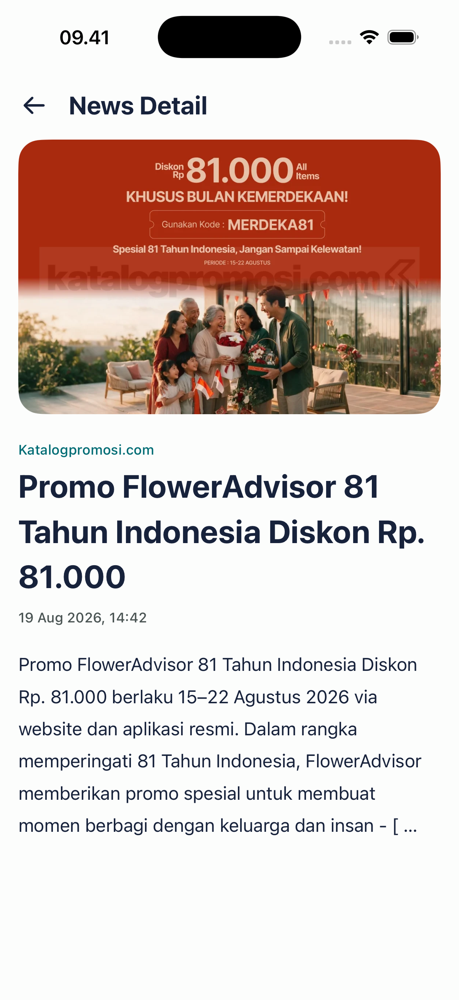 |  |
| 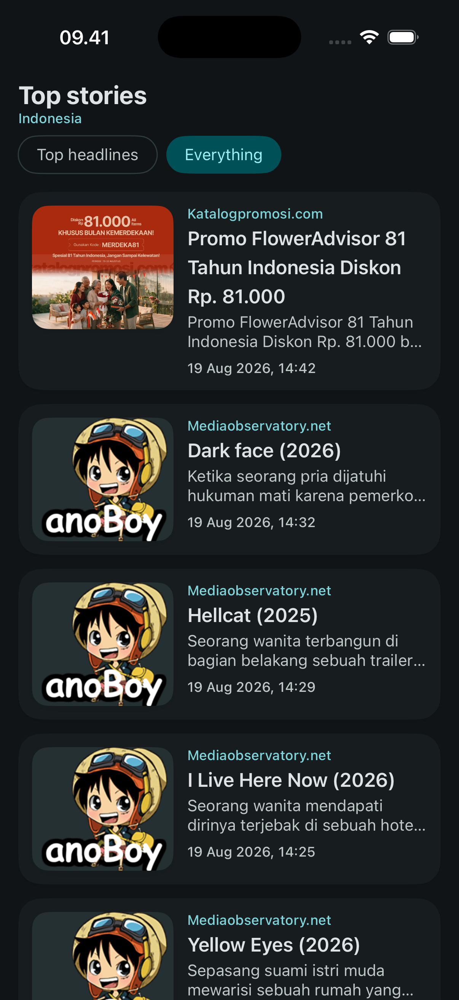 | 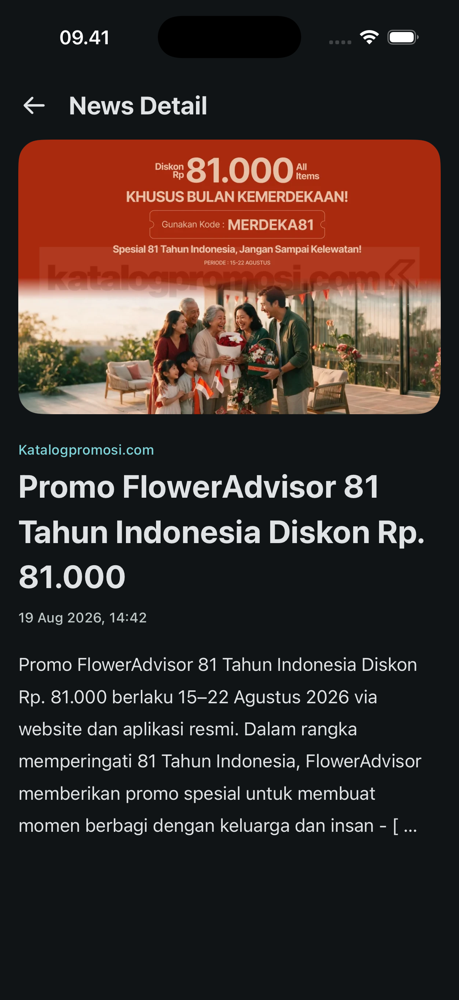 | 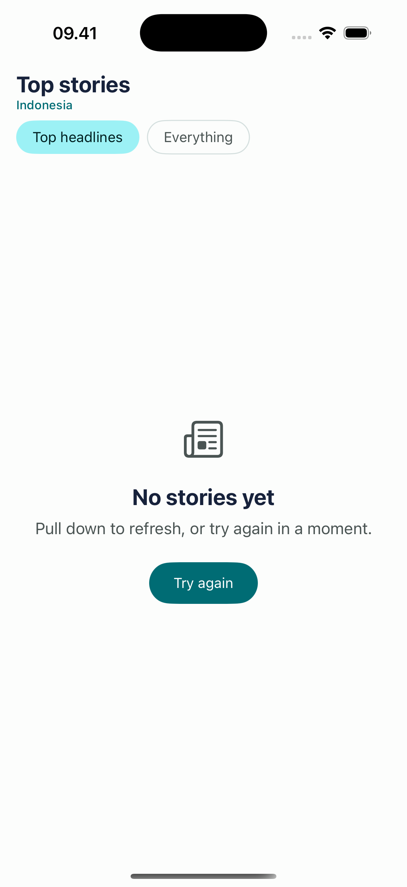 |

The empty **Top headlines** tab is expected, not a failure: `/v2/top-headlines?country=id` returns
an empty `articles` array on free NewsAPI plans, so the app treats it as a legitimate empty result
with a retry, while the **Everything** tab supplies real Indonesian content through keyword queries.

## Setup

### Prerequisites

- Android Studio with JDK 17 and Android SDK 36.
- Xcode 16 or newer to build and run the bonus iOS app (Xcode 26.6 used locally).
- A development key from [NewsAPI](https://newsapi.org/register).

### Configure the API key

1. Clone this repository.
2. Let Android Studio create `local.properties` with your `sdk.dir` value.
3. Add one line to that local-only file:

   ```properties
   NEWS_API_KEY=your_development_key_here
   ```

   Alternatively, export an environment variable named `NEWS_API_KEY` before building.

4. Sync and run the `androidApp` configuration.

### Configure the API key for iOS

The iOS app reads the same key from a git-ignored xcconfig:

```bash
cp iosApp/Configuration/Secrets.xcconfig.example iosApp/Configuration/Secrets.xcconfig
# then edit NEWS_API_KEY in that file
```

The key has to be set in both places because Xcode reads xcconfig files before any build phase
runs, so the value cannot be injected from `local.properties` during the build itself.

`Configuration/Config.xcconfig` is committed, declares an empty `NEWS_API_KEY`, and optionally includes `Secrets.xcconfig`, so the project builds without the secret and simply reports the missing-key state at runtime.

## Running the apps

### Android

Open the project in Android Studio and run the `androidApp` configuration, or from a terminal with an emulator running:

```bash
./gradlew :androidApp:installDebug
adb shell am start -n com.ahmaddody.newsreader/.MainActivity
```

### iOS

Android Studio cannot launch iOS apps, so the iOS client is a normal Xcode project:

```bash
open iosApp/NusaNews.xcodeproj   # then pick an iPhone simulator and press Run
```

The Xcode target's first build phase invokes `./gradlew :shared:embedAndSignAppleFrameworkForXcode`, so the shared framework is always rebuilt, embedded, and signed from the same Kotlin sources — no checked-in binary. From the command line:

```bash
xcodebuild -project iosApp/NusaNews.xcodeproj -scheme NusaNews \
  -sdk iphonesimulator -destination 'platform=iOS Simulator,name=iPhone 17 Pro' build
```

`iosApp/project.yml` is the [XcodeGen](https://github.com/yonaskolb/XcodeGen) definition of that project; the generated `.xcodeproj` is committed so reviewers do not need XcodeGen installed. Regenerate with `cd iosApp && xcodegen generate` after changing target settings.

[`local.properties.example`](local.properties.example) documents the expected key without containing a secret. `local.properties`, `secrets.properties`, keystores, and build output are ignored. The key is compiled into the local Android `BuildConfig`, passed into shared configuration, sent in the `X-Api-Key` header, and redacted from Ktor logs. A missing key never crashes the app: readers see a plain "news isn't available right now" message with a retry, while the setup instructions are logged once at startup under the `NewsReaderSetup` tag (Logcat on Android, the Xcode console on iOS).

## Build and test

Use the checked-in wrapper from the repository root:

```bash
./gradlew :shared:testAndroidHostTest
./gradlew :shared:iosSimulatorArm64Test
./gradlew :shared:compileKotlinIosSimulatorArm64
./gradlew :shared:connectedAndroidDeviceTest
./gradlew :androidApp:assembleDebug
./gradlew :androidApp:connectedDebugAndroidTest
./gradlew :androidApp:lintDebug
```

Both `connected...Test` commands need a running emulator or connected device.

Verified locally on 13 August 2026 (host tests and the debug build re-verified on 20 August 2026):

- `:shared:testAndroidHostTest` — passed, 12 tests.
- `:shared:iosSimulatorArm64Test` — passed, the same 12 shared tests executed on an iOS simulator (re-verified 20 August 2026).
- `:shared:compileKotlinIosSimulatorArm64` and `:shared:compileKotlinIosArm64` — passed, including Room KSP generation.
- `:shared:connectedAndroidDeviceTest` — passed, 1 real in-memory Room integration test.
- `:androidApp:assembleDebug` — passed.
- `:androidApp:connectedDebugAndroidTest` — passed, 2 tests on an API 36 Pixel 7 AVD.
- `:androidApp:lintDebug` — passed with no errors.
- `xcodebuild ... -scheme NusaNews -sdk iphonesimulator` — passed on 18 August 2026; the app installs and launches on an iPhone 17 Pro simulator (Xcode 26.6).
- Debug APK: `androidApp/build/outputs/apk/debug/androidApp-debug.apk`.

The project pins AGP 9.1.0 and Gradle 9.3.1. It was also verified with a locally installed Gradle 9.4.1, which sits inside Kotlin 2.4.10's supported range.

## Architecture

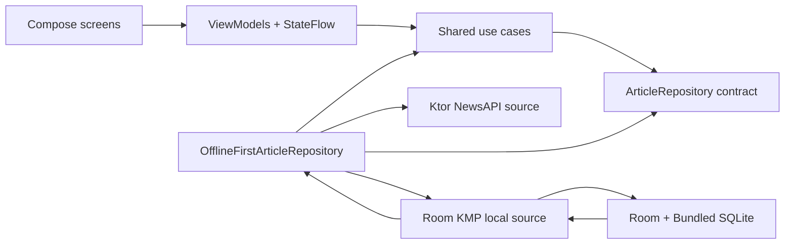

Two Gradle modules keep the submission focused:

- `:shared`
  - `commonMain/domain`: models, errors, repository contract, use cases, and date formatting.
  - `commonMain/data`: NewsAPI DTOs/mapping, Ktor client policy, Room 3 entities/DAO/database, data sources, and the offline-first repository.
  - `commonMain/di`: shared Koin definitions.
  - `androidMain`: only Android `Context` database construction and the OkHttp engine.
  - `iosMain`: only the Foundation database path, Room builder, Darwin engine, and Swift-friendly Koin initializer.
  - `androidDeviceTest`: a real in-memory Room integration test for replacement, ordering, observation, and stale-row removal.
  - `commonTest`: behavior-focused repository/network/date tests.
- `:androidApp`
  - Compose UI, ViewModels/StateFlow, typed Navigation Compose routes, Coil, Android resources, and instrumentation tests.
- `iosApp` (not a Gradle module)
  - SwiftUI screens plus two small `ObservableObject` models that mirror the Android ViewModels. They hold no business rules: `NewsFacade` in `iosMain` adapts shared `Flow`s to Swift callbacks and shared `suspend` functions to Swift `async`, because Swift cannot consume `Flow` or Kotlin default arguments directly.

Data implementations are `internal`; Android code consumes public domain use cases and models. No Composable calls the network or database.

## Offline-first data flow

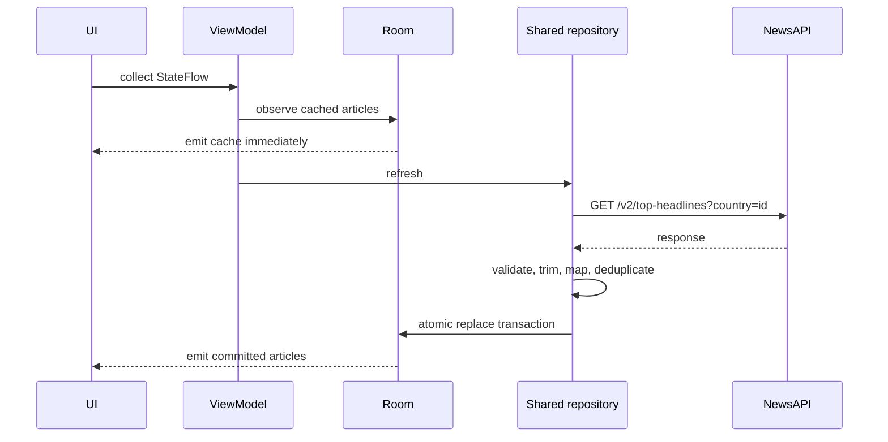

Important invariants:

- The remote response is never displayed directly.
- A request must succeed and validate before Room is touched.
- Delete + upsert runs in one Room transaction, avoiding transient empty emissions.
- A non-empty payload whose articles are all unusable, or a payload that omits `articles`, is treated as malformed and cannot wipe a valid cache.
- Network failure with cache returns a non-blocking error; the cached list remains visible.
- Network plus cache-read failure produces a typed blocking storage error.
- Coroutine cancellation is always rethrown.
- Detail receives only an article ID and observes the cached record; it does not refetch.

## Error model

Shared code maps failures to domain errors such as `MissingApiKey`, `NetworkUnavailable`, `Timeout`, `Unauthorized`, `RateLimited`, `ServerUnavailable`, `MalformedResponse`, and `DatabaseUnavailable`. Android presentation maps them to resource-backed, actionable messages.

The list has four durable display modes:

1. Full-screen initial loading when no cache has emitted.
2. Content, including content shown immediately from a previous launch.
3. Graceful empty state after a legitimate successful empty response.
4. Blocking retry state only when there is no usable content.

A refresh failure with existing cache keeps content on-screen, adds a saved-stories notice, and offers retry through a snackbar.

## Test strategy

### Shared behavior tests

- Fetch → validate/map/deduplicate → atomic local replacement → observed cached articles.
- Remote failure preserves and reports existing cache.
- Remote failure without cache produces a typed network error without a false cache claim.
- Remote plus local failure produces a database error with no false cache claim.
- All-malformed remote items cannot erase a good cache.
- Omitted `articles` payload cannot erase a good cache.
- Final Ktor URL is exactly `/v2/top-headlines?country=id`, with the key in `X-Api-Key`.
- ISO dates format deterministically, while unknown values fail safely.

The common repository tests use fakes at the local/remote ports so they verify policy without mocking implementation details. Room code generation, schema export, DAO queries, and the Android builder are also exercised during every Android compile.

`ArticleRoomIntegrationTest` additionally runs the generated DAO against a real in-memory Room database on Android. It verifies chronological ordering, observed replacement, detail lookup, and stale-row removal. Schema migration tests become relevant when the database advances beyond version 1.

### Compose device tests

- Launch list → tap stable article semantics → show detail → app-bar back returns to list.
- Remote failure with cached content still renders the article and saved-content notice.
- Switching the feed chip swaps to the other feed's cached articles.
- Tapping the detail image opens the full-screen viewer, and closing it returns to the article.

The tests use deterministic fakes and Compose synchronization—no live API, `Thread.sleep`, or brittle coordinate taps.

## Technical decisions and trade-offs

- **Android-native UI, shared data/domain:** the brief requires Android Compose and meaningful KMP sharing, not shared UI. This keeps platform UI idiomatic while the same portable pipeline compiles for Android plus iOS device/simulator targets; static iOS frameworks are configured for an Xcode host.
- **Room 3.0.1:** chosen because it is the current official greenfield KMP setup. It uses `androidx.room3` with the bundled SQLite driver; Room 2 and Room 3 APIs are not mixed.
- **Header authentication:** `X-Api-Key` keeps the secret out of URLs and is sanitized in debug logs.
- **Hand-written fakes instead of MockK:** the brief allows "MockK or an equivalent KMP-compatible mocking approach". MockK has no Kotlin/Native or common-source-set support, so mocking it would have forced the repository tests out of `commonTest` and onto Android only. Fakes implementing `ArticleRemoteDataSource` and `ArticleLocalDataSource` keep those tests in shared code, run on every target, and assert behavior at the port boundary rather than call order on a mock.
- **Stable ID:** the trimmed article URL is preferred; source + title + timestamp is a deterministic fallback. Random IDs would duplicate records each refresh.
- **Replace instead of append:** NewsAPI top headlines represents a snapshot. Replacing the table gives deterministic ordering and removes expired headlines. The transaction prevents observers from seeing an intermediate blank table.
- **Empty response semantics:** a valid `articles: []` clears stale top headlines and shows an empty state; missing or wholly malformed articles preserve cache.
- **Two native UIs over one shared core:** the brief requires Jetpack Compose on Android and lists extra platform targets as a bonus, so no shared-UI framework was introduced. Android and iOS each use their idiomatic toolkit while the identical `commonMain` pipeline — repository policy, Room persistence, Ktor client, error mapping, date formatting — serves both. The iOS app is proof that the shared layer is genuinely portable rather than decorative: the whole `commonTest` suite also runs on an iOS simulator.
- **Error copy is written for readers, not developers:** every `AppError` maps to a plain-language message with a recovery action. Configuration failures — a missing or rejected API key — deliberately show the same neutral "news isn't available right now" text as any other outage, because a reader can do nothing with a build instruction. The actionable detail is logged at startup instead, so the problem stays obvious to whoever is running the project. Both platforms share the wording verbatim.
- **A drawn top bar instead of the system navigation bar on iOS:** iOS 26 restyles navigation-bar items into glass capsules and truncates a leading title, so the detail screen showed a circular chevron next to "N…" while Android showed an arrow beside "News Detail". `NewsTopBar` draws the Material layout directly — leading arrow, left-aligned title, optional primary subtitle — and both iOS screens hide the system bar. The trade-off is that iOS loses the system-drawn bar; the interactive swipe-back gesture is kept by hiding the toolbar rather than hiding the back button.
- **One design language, two native toolkits:** `iosApp/NusaNews/DesignSystem.swift` mirrors the Android theme token for token — the same palette from `Theme.kt`, the same spacing and radii from `NewsDimens.kt`, the same type scale from `Type.kt`, and the same user-facing copy as `strings.xml`. Both clients therefore show identical colours, metrics, and wording while each still uses its platform's idiomatic controls (Material `FilterChip` and snackbar; SwiftUI buttons and a matching bottom message). A token change is a two-file change, and the files name each other so the pairing is discoverable.
- **Thin Swift interop layer:** `NewsFacade` exists only because Kotlin `Flow` and default arguments are not exportable to Swift. It adds no policy; failure classification, cache rules, and formatting stay in `commonMain`, so a behavior change lands on both platforms at once.

## Bonus features included

- System dark theme.
- Common KMP tests, executed on both the Android host JVM and an iOS simulator.
- A second platform target that actually runs: a native SwiftUI iOS app over the same shared code.
- Pull-to-refresh (treated as mandatory because it also appears in the core screen requirements).
- Accessibility descriptions and stable semantics/test tags.
- Full-screen image viewer on the article detail image: pinch to zoom, drag to pan, double-tap to toggle, on both platforms.
- Type-safe serializable navigation routes.
- Release minification rules for Room.

Pagination was deliberately skipped in favour of complete offline/error/test behaviour.

## AI-assisted development

AI was used as an engineering partner throughout this project, driven from the IDE terminal with an
agentic coding assistant. Every change below was reviewed, challenged, and — where the agent was
wrong — corrected before it stayed in the repository. The most valuable part of the workflow was not
the code generation; it was catching what the agent got wrong.

The rules I worked under:

- The agent proposes; I decide what ships. Nothing lands unreviewed.
- The agent does not run installs or launches on my devices — I run and verify those myself.
- Anything touching persistence, concurrency, networking, or error handling gets read line by line.
- Every fix must be verified by a test or a real run, not by the agent asserting it works.

### Representative tasks

| # | Task and prompt | What the agent produced | What I changed, rejected, or pushed back on |
|---|---|---|---|
| 1 | **Make the iOS target actually runnable.** "Why iOS cannot run? It should be can run it. Why in Android Studio there is no runnable? Add it." | The project only built iOS **frameworks** — no runnable app. The agent added `iosApp`: a native SwiftUI client, an XcodeGen-defined project, a build phase that rebuilds and embeds the shared framework, and `NewsFacade` in `iosMain` to bridge Kotlin `Flow`/`suspend` into Swift callbacks and `async`. | I rejected the original framing that iOS was "out of scope" — a KMP submission that cannot run its second platform is not proving much. I accepted the agent's correction that **Android Studio cannot launch iOS apps** (Xcode does), so that limitation is documented rather than worked around. I required the interop layer to hold no business rules; policy stays in `commonMain`. |
| 2 | **Work around the empty Indonesian headline feed.** "The docs said use top-headlines but for Indonesian it is empty. Can you make tab chip Top Headlines and Everything? Because `/v2/top-headlines` has limited regional source mapping on free plan. Better try `/v2/everything` with query keywords, like `q=indonesia` or specific local topics, instead of filter strictly by `country=id`." | A `NewsFeed` enum in `commonMain`, `/v2/everything?q=indonesia&language=id` alongside `/v2/top-headlines?country=id`, Material `FilterChip`s on Android, a matching chip row on iOS, and per-feed caching. | The agent's first cut kept **one** Room table for both feeds, which silently wiped one tab's cache when the other refreshed. I made it a composite `(id, feed)` primary key with per-feed replacement, which meant a schema change: database v2 plus a real migration that recreates the table and preserves existing rows, covered by a device test. I also required that a failing feed never reports the *other* feed's cache as usable. |
| 3 | **Debug two build and runtime failures.** "Build failed, this the error: `BuildException: …/desugar_graph/debug/dexBuilderDebug/out/currentProject/dirs_bucket_1/graph.bin (No such file or directory)`," and later "now the app crash when open, this the log: `Unable to get provider androidx.startup.InitializationProvider` → `ClassNotFoundException`. Find the real cause please." | First diagnosis: a dependency conflict introduced by an `androidx.test:runner` version bump. | **This diagnosis was wrong and I did not accept it.** The dependency graph showed `androidx.startup:startup-runtime` correctly resolved, so a conflict could not explain a missing class. Scanning the APK's dex files showed the class absent from the artifact itself. The real cause was a **poisoned Gradle build-cache entry** written by an earlier interrupted build: every later build restored the corrupt dex output in seconds and reported success, and `clean` did not help because it wipes `build/` but not the cache. `--rerun-tasks` rewrote the entry and the crash disappeared. No source change was needed. |
| 4 | **Unify the two clients visually.** "The UI is inconsistent on a few pages. Make the UI look consistent across both platforms." | `DesignSystem.swift`, mirroring the Android theme token for token — palette from `Theme.kt`, metrics from `NewsDimens.kt`, type scale from `Type.kt`, copy from `strings.xml` — and both iOS screens rebuilt on those tokens. | I kept Android as the reference and required iOS to move, not the other way round, since Android is the graded deliverable. I also required behavioural parity, not just visual: the iOS message banner now auto-dismisses on the same ten-second timing as the Material snackbar and tracks "already seen" per feed, matching the Android `messageConsumed` flag. |
| 5 | **Stop configuration details leaking into the UI.** "The error state is leaking environment configuration to the user. Use non-technical, user-friendly wording instead, and you decide the exact copy." | Error copy on both platforms rewritten in plain language, with the configuration detail moved to a startup log under the `NewsReaderSetup` tag. | The agent had shipped **"Add NEWS_API_KEY to Configuration/Secrets.xcconfig, then rebuild the app."** as on-screen text. That is a build instruction shown to a reader who cannot act on it. I had it replaced with a neutral "News isn't available right now" — deliberately identical to any other outage, because a reader cannot distinguish a missing key from a dead server and should not have to. |
| 6 | **Align navigation chrome and fix a layout defect.** "Make the iOS navigation bar the same as Android, or give both platforms the same navigation bar style," and later "in the full-screen image dialog, the close button is not inside the top safe area." | A shared `NewsTopBar` drawn directly instead of using the system navigation bar, and a corrected safe-area layout in the full-screen image viewer. | iOS 26 restyles navigation-bar items into glass capsules; the detail screen showed a circular chevron beside a truncated **"N…"** while Android showed an arrow beside "News Detail". I rejected fighting the system bar through appearance proxies and had it drawn directly — while requiring that the fix hide the *toolbar* rather than the *back button*, so the interactive swipe-back gesture survives. In the image viewer the agent had applied `ignoresSafeArea()` to the whole stack, putting the close button under the Dynamic Island; only the backdrop and image should bleed. |

### Mistakes the agent made that I caught

1. **Wrong root cause, confidently stated.** The dexing crash was blamed on a dependency version bump. The dependency graph disproved it. The actual fault was a corrupt build-cache artifact — invisible in Gradle output, which kept reporting `BUILD SUCCESSFUL`. Verified by scanning the packaged dex for the missing class before and after `--rerun-tasks`.
2. **Developer instructions leaked into the UI.** Setup text was shown to end users as an error message. Replaced with plain language; the actionable detail now goes to Logcat and the Xcode console instead.
3. **A cache design that lost data.** The first feed-switcher implementation shared one table between both feeds, so refreshing one tab discarded the other's offline content — precisely the behaviour this app exists to prevent. Fixed with a composite key, a migration, and tests.
4. **A layout that ignored the safe area.** `ignoresSafeArea()` was applied to a whole container instead of only the backdrop, placing the close button under the Dynamic Island.
5. **Assuming configuration instead of checking it.** The agent reported the iOS app as working when it had never been given an API key; `Secrets.xcconfig` did not exist. It now fails loudly in the console instead of silently rendering an empty state.

### Where AI genuinely helped

Scaffolding the iOS client and its project file, porting the Android design tokens to SwiftUI,
writing the Room migration SQL against the exported schema, and turning half-formed prompts into
tests I would otherwise have skipped — the per-feed cache-isolation tests and the migration test
both came out of arguing with it about what could go wrong.

## Known limitations and future work

- NewsAPI development keys may have usage and distribution constraints; this project is intended for take-home/development evaluation.
- The detail screen presents the API description because the supplied endpoint does not provide full article bodies.
- The app currently has no pagination.
- The iOS app is a bonus and covers the same two screens as Android, but it has no XCTest/UI-test suite; iOS confidence comes from the shared `commonTest` suite running on the simulator. Android remains the fully tested deliverable.
- The iOS app requires a machine with Xcode; `xcodegen` is only needed if you want to regenerate the project file.
- `createComposeRule()` emits a deprecation warning against the newer `junit4.v2` rule, which switches to `StandardTestDispatcher`. The migration is deferred so the passing device tests are not destabilised close to submission.
- Add Room schema-migration tests when the database grows beyond version 1.
- Add CI after choosing a public repository host and a secret-safe build strategy.

## Submission checklist

- [x] Runnable Android Studio project and Gradle wrapper.
- [x] No real API key or secret in the repository.
- [x] Setup, architecture, offline flow, decisions, tests, bonuses, and limitations documented.
- [x] Shared tests, Android build, and device tests pass.
- [x] Document the AI-assisted sessions, including mistakes found and corrected.
- [x] Add representative Android and iOS screenshots taken with a configured NewsAPI key.

## License

This repository is a recruitment take-home submission. No separate reuse license is granted unless one is added explicitly.
